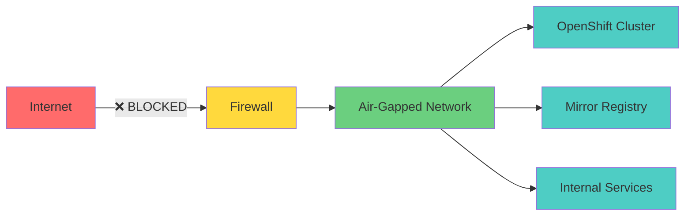
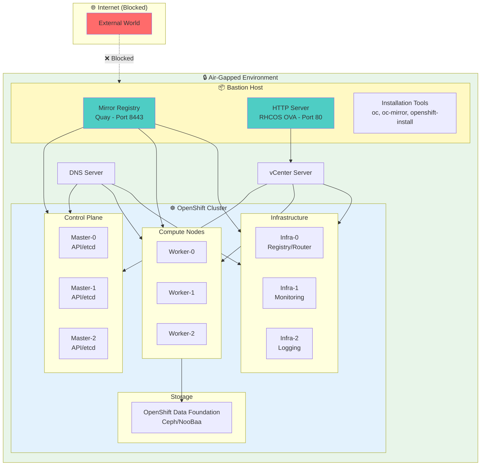
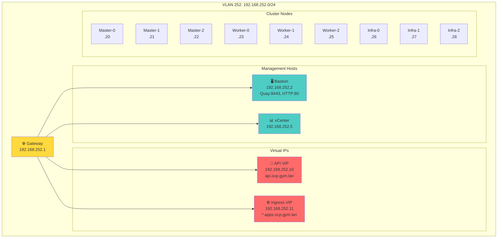
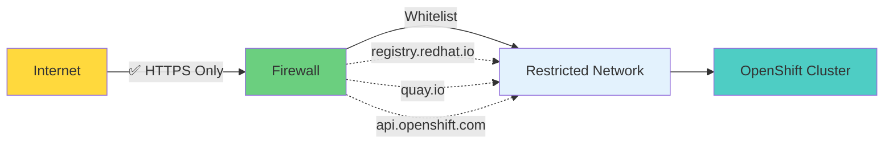

# 🔒 OpenShift 4.18 Air-Gapped Installation Guide

<div align="center">


**The definitive guide for deploying Red Hat OpenShift Container Platform in completely isolated, air-gapped environments**

[📖 Quick Start](#-quick-start) • [🏗️ Architecture](#️-architecture) • [📚 Documentation](#-documentation) • [🚀 Installation](#-installation-phases) • [🔧 Troubleshooting](#-troubleshooting)

</div>

---

## 🎯 Overview

Deploy **production-ready OpenShift clusters** in networks with **zero internet connectivity**. Perfect for highly regulated industries:

- 🏦 **Financial Services** - PCI-DSS, SOX compliance
- 🏛️ **Government/Defense** - FISMA High, DoD IL4/IL5
- 🏥 **Healthcare** - HIPAA, medical records platforms
- 🏭 **Manufacturing** - OT/IT separation, IP protection

### What is Air-Gapped?



**Key Characteristics:**
- ✅ **Zero internet** connectivity post-deployment
- ✅ **Local mirrors** for all images and operators
- ✅ **Complete isolation** from external threats
- ✅ **Compliance-ready** for strictest requirements

---

## 📊 What You'll Deploy

<table>
<tr>
<td width="50%">

### 🖥️ Cluster Specifications

| Component | Count | vCPU | RAM | Disk |
|-----------|-------|------|-----|------|
| Control Plane | 3 | 4 | 16GB | 120GB |
| Compute | 3 | 4 | 16GB | 120GB |
| Infrastructure | 3 | 16 | 64GB | 120GB |
| **Total** | **9** | **96** | **288GB** | **1.08TB** |

</td>
<td width="50%">

### ⏱️ Time Investment

| Phase | Duration |
|-------|----------|
| Planning & Prep | 2-4 hours |
| Mirror Setup | 1-2 hours |
| Content Mirror | 2-4 hours |
| Installation | 45-60 min |
| Post-Install | 1-2 hours |
| **Total** | **8-15 hours** |

</td>
</tr>
</table>

---

## 🏗️ Architecture

### System Architecture



### Network Topology



---

## 🚀 Quick Start

<details>
<summary><b>For Experienced Users (Click to Expand)</b></summary>

```bash
# 1. Prepare bastion with 1.5TB storage
ssh admin@bastion.gym.lan

# 2. Install mirror registry
./mirror-registry install --quayHostname 192.168.252.2 \
    --initUser admin --initPassword 'QuayForAll!' \
    --sslCert quay.crt --sslKey quay.key

# 3. Mirror content (2-4 hours)
oc-mirror --config=imageset-config.yaml file://ocp-4.18
oc-mirror --from=file://ocp-4.18 docker://192.168.252.2:8443

# 4. Block internet access (implement air-gap)

# 5. Deploy cluster
openshift-install create cluster --dir=./install --log-level=info
```

⏱️ **Total Time:** 4-6 hours (mostly automated)

📖 **Need detailed steps?** Continue reading below.

</details>

---

## ✅ Prerequisites

### 📋 Infrastructure Checklist

<table>
<tr><td>

**VMware vSphere**
- [ ] vSphere 7.0+ with proper licensing
- [ ] vCenter admin access
- [ ] Service account with [required permissions](#vsphere-permissions)
- [ ] Resource pool configured
- [ ] Datastore with 1.5TB+ free space

</td><td>

**Network Infrastructure**
- [ ] DNS server configured ([required records](#dns-records))
- [ ] DHCP or static IP plan
- [ ] Firewall configured for isolation
- [ ] Network with 1+ Gbps throughput
- [ ] VLANs configured (if required)

</td></tr>
<tr><td>

**Bastion Host**
- [ ] RHEL 8.6+ or RHEL 9.0+
- [ ] 8+ vCPU, 16+ GB RAM
- [ ] 1.5 TB disk space
- [ ] Internet access (initially)
- [ ] SSH access configured

</td><td>

**Software & Access**
- [ ] Red Hat account with valid subscription
- [ ] Pull secret from console.redhat.com
- [ ] OpenShift tools downloaded
- [ ] vCenter credentials
- [ ] Team knowledge (Linux, Kubernetes, vSphere)

</td></tr>
</table>

### 🌐 DNS Records

All records must resolve **before** installation:

```bash
# Required DNS A Records
api.ocp.gym.lan.              IN A    192.168.252.10
api-int.ocp.gym.lan.          IN A    192.168.252.10
*.apps.ocp.gym.lan.           IN A    192.168.252.11

# Infrastructure Records
bastion.gym.lan.              IN A    192.168.252.2
registry.gym.lan.             IN A    192.168.252.2

# Verify DNS is working
dig +short api.ocp.gym.lan
# Expected: 192.168.252.10
```

### 🔐 vSphere Permissions

<details>
<summary><b>Required vSphere Permissions (Click to Expand)</b></summary>

The service account needs these permissions at the Datacenter level:

- **Datastore**: Allocate space, Browse, Low level file operations
- **Folder**: Create folder, Delete folder
- **Network**: Assign network
- **Resource**: Assign VM to pool, Migrate powered off/on VM
- **vApp**: Assign resource pool, Import
- **Virtual Machine**: All Configuration and Provisioning permissions

Use `govc` to create the role:
```bash
govc role.create openshift-installer \
    Datastore.AllocateSpace \
    Datastore.Browse \
    VirtualMachine.Config.* \
    VirtualMachine.Provisioning.* \
    # ... (see full list in docs/)
```

</details>

---

## 📚 Documentation

### Core Documents

| Document | Purpose | Audience |
|----------|---------|----------|
| **[Installation Guide](docs/INSTALLATION-GUIDE.md)** | Complete step-by-step technical guide | Engineers, SREs |
| **[Troubleshooting](docs/TROUBLESHOOTING.md)** | Common issues and solutions | Operations |
| **[FAQ](docs/FAQ.md)** | Frequently asked questions | All users |
| **[Best Practices](docs/BEST-PRACTICES.md)** | Production recommendations | Architects |

### Specialized Topics

- **[Security Hardening](docs/security/)** - CIS benchmarks, RBAC, NetworkPolicies
- **[Day 2 Operations](docs/day2-ops/)** - Upgrades, backups, monitoring
- **[Performance Tuning](docs/performance/)** - Optimization for production
- **[Disaster Recovery](docs/backup/)** - Backup strategies, restore procedures

---

## 🚀 Installation Phases

### Phase 1: Infrastructure Preparation

<details>
<summary><b>📦 Bastion Setup & Storage (2-4 hours)</b></summary>

**Objectives:**
- Deploy RHEL bastion host
- Add 1.5TB storage for mirror content
- Install required packages
- Configure firewall

**Steps:**

```bash
# Add disk via vSphere GUI (1.5TB)
# Then extend filesystem:

sudo lsblk
sudo vgextend rhel_bastion /dev/sdb
sudo lvextend -l +100%FREE /dev/rhel_bastion/root
sudo xfs_growfs /
df -h /
# Should show ~1.6TB

# Install packages
sudo dnf install -y podman httpd jq git wget curl bind-utils
```

**Validation:**
```bash
df -h / | grep -q "1\.[5-6]T" && echo "✅ Storage OK" || echo "❌ Storage insufficient"
```

📖 **[Detailed Instructions →](docs/INSTALLATION-GUIDE.md#phase-1)**

</details>

### Phase 2: Mirror Registry Setup

<details>
<summary><b>🗄️ Install Quay Mirror Registry (1-2 hours)</b></summary>

**Objectives:**
- Generate TLS certificates
- Install Red Hat Quay mirror registry
- Configure firewall for registry access
- Verify registry health

**Steps:**

```bash
# Generate self-signed certificate
openssl req -newkey rsa:4096 -nodes -sha256 \
    -keyout quay.key -x509 -out quay.crt -days 3650 \
    -subj "/CN=registry.gym.lan" \
    -addext "subjectAltName=DNS:registry.gym.lan,IP:192.168.252.2"

# Download and install mirror registry
curl -Lo mirror-registry.tar.gz \
    https://mirror.openshift.com/pub/cgw/mirror-registry/latest/mirror-registry-amd64.tar.gz
tar xf mirror-registry.tar.gz

./mirror-registry install \
    --quayHostname 192.168.252.2 \
    --initUser admin \
    --initPassword 'QuayForAll!' \
    --sslCert quay.crt \
    --sslKey quay.key

# Configure firewall
sudo firewall-cmd --permanent --add-port=8443/tcp
sudo firewall-cmd --reload

# Verify
curl -sk https://192.168.252.2:8443/health/instance | jq
# Should return status_code: 200
```

**Validation:**
```bash
podman login 192.168.252.2:8443 -u admin -p 'QuayForAll!'
# Should show: Login Succeeded!
```

📖 **[Detailed Instructions →](docs/INSTALLATION-GUIDE.md#phase-2)**

</details>

### Phase 3: Content Mirroring

<details>
<summary><b>📥 Mirror OpenShift Images (2-4 hours)</b></summary>

**Objectives:**
- Download OpenShift client tools
- Configure ImageSet for mirroring
- Mirror platform images and operators
- Push content to local registry

**Create ImageSet Configuration:**

```yaml
# imageset-config.yaml
kind: ImageSetConfiguration
apiVersion: mirror.openshift.io/v1alpha2
storageConfig:
  registry:
    imageURL: 192.168.252.2:8443/metadata:latest
mirror:
  platform:
    channels:
      - name: stable-4.18
        minVersion: 4.18.0
        maxVersion: 4.18.0
  operators:
    - catalog: registry.redhat.io/redhat/redhat-operator-index:v4.18
      packages:
        - name: odf-operator
        - name: local-storage-operator
        - name: openshift-cert-manager-operator
  additionalImages:
    - name: registry.redhat.io/ubi8/ubi:latest
```

**Execute Mirroring:**

```bash
# Download oc-mirror
curl -Lo oc-mirror.tar.gz \
    https://mirror.openshift.com/pub/openshift-v4/clients/ocp/stable-4.18/oc-mirror.tar.gz
tar xf oc-mirror.tar.gz
sudo install oc-mirror /usr/local/bin/

# Mirror to disk (internet required)
oc-mirror --config=imageset-config.yaml file://ocp-4.18

# Push to registry (after air-gap)
oc-mirror --from=file://ocp-4.18 docker://192.168.252.2:8443
```

**⚠️ CRITICAL:** Save the generated `imageContentSourcePolicy.yaml` from the results directory!

**Validation:**
```bash
# Verify repository count
curl -sk -u admin:QuayForAll! \
    https://192.168.252.2:8443/v2/_catalog | jq '.repositories | length'
# Should show 50+ repositories
```

📖 **[Detailed Instructions →](docs/INSTALLATION-GUIDE.md#phase-3)**

</details>

### Phase 4: Network Isolation

<details>
<summary><b>🔒 Implement Air-Gap (30 minutes)</b></summary>

**Objectives:**
- Configure firewall to block internet
- Verify complete isolation
- Test internal connectivity

**Implement Firewall Rules:**

```bash
# Option 1: Using iptables (if bastion is gateway)
sudo iptables -A OUTPUT -d 192.168.252.0/24 -j ACCEPT
sudo iptables -A OUTPUT -d 127.0.0.1/8 -j ACCEPT
sudo iptables -A OUTPUT -j REJECT
sudo iptables-save > /etc/iptables/rules.v4

# Option 2: Configure network firewall/router
# Block all outbound traffic from 192.168.252.0/24 to internet
```

**Verification Script:**

```bash
#!/bin/bash
echo "=== Air-Gap Verification ==="

# Should FAIL (blocked)
ping -c 2 google.com > /dev/null 2>&1 && \
    echo "❌ SECURITY ISSUE: Internet accessible!" || \
    echo "✅ Internet blocked (expected)"

# Should SUCCEED (internal)
curl -sk https://192.168.252.2:8443/health/instance | grep -q "200" && \
    echo "✅ Registry accessible" || \
    echo "❌ Registry not accessible"

ping -c 2 vcenter.gym.lan > /dev/null 2>&1 && \
    echo "✅ vCenter accessible" || \
    echo "❌ vCenter not accessible"
```

📖 **[Detailed Instructions →](docs/INSTALLATION-GUIDE.md#phase-4)**

</details>

### Phase 5: Cluster Installation

<details>
<summary><b>☸️ Deploy OpenShift Cluster (45-60 minutes)</b></summary>

**Objectives:**
- Create install-config.yaml
- Deploy cluster using IPI
- Verify successful installation
- Access web console

**Create Configuration:**

```yaml
# install-config.yaml
apiVersion: v1
baseDomain: gym.lan
metadata:
  name: ocp
compute:
- name: worker
  replicas: 3
  platform:
    vsphere:
      cpus: 4
      memoryMB: 16384
      osDisk:
        diskSizeGB: 120
controlPlane:
  name: master
  replicas: 3
  platform:
    vsphere:
      cpus: 4
      memoryMB: 16384
      osDisk:
        diskSizeGB: 120
platform:
  vsphere:
    vcenter: vcenter.gym.lan
    username: ocp-installer@vsphere.local
    password: "YourPassword"
    datacenter: Datacenter
    defaultDatastore: datastore1
    cluster: Cluster
    network: "VM Network"
    apiVIP: 192.168.252.10
    ingressVIP: 192.168.252.11
    clusterOSImage: http://192.168.252.2/rhcos-vmware.x86_64.ova
pullSecret: 'YOUR_PULL_SECRET_HERE'
sshKey: 'YOUR_SSH_PUBLIC_KEY'
additionalTrustBundle: |
  -----BEGIN CERTIFICATE-----
  YOUR_QUAY_CERTIFICATE_HERE
  -----END CERTIFICATE-----
imageContentSources:
  - mirrors:
      - 192.168.252.2:8443/openshift/release
    source: quay.io/openshift-release-dev/ocp-release
  - mirrors:
      - 192.168.252.2:8443/openshift/release-images
    source: quay.io/openshift-release-dev/ocp-v4.0-art-dev
```

**Deploy Cluster:**

```bash
# Create cluster
openshift-install create cluster --dir=./install --log-level=info

# Monitor progress (in another terminal)
tail -f ./install/.openshift_install.log
```

**Installation Stages:**

```mermaid
gantt
    title OpenShift Installation Timeline
    dateFormat mm
    axisFormat %M min
    
    section Bootstrap
    Bootstrap VM     :00, 15m
    
    section Control Plane
    Master Nodes     :15, 20m
    etcd Quorum      :25, 10m
    
    section Workers
    Bootstrap Remove :35, 5m
    Worker Nodes     :40, 15m
    
    section Finalize
    Operators Init   :55, 10m
```



**Validation:**

```bash
export KUBECONFIG=./install/auth/kubeconfig

# Check cluster version
oc get clusterversion

# Verify all nodes
oc get nodes

# Check operators (all should be Available=True)
oc get co

# Get console URL
oc whoami --show-console
# Get admin password
cat ./install/auth/kubeadmin-password
```

📖 **[Detailed Instructions →](docs/INSTALLATION-GUIDE.md#phase-5)**

</details>

### Phase 6: Post-Installation

<details>
<summary><b>⚙️ Infrastructure Nodes & Storage (1-2 hours)</b></summary>

**Objectives:**
- Create infrastructure node MachineSet
- Move platform services to infra nodes
- Deploy OpenShift Data Foundation
- Configure storage classes

**Quick Steps:**

```bash
# Create infrastructure MachineSet (3 nodes with 16 vCPU, 64GB RAM)
oc create -f infra-machineset.yaml

# Move ingress to infra nodes
oc patch ingresscontroller default -n openshift-ingress-operator \
    --type=merge --patch='{"spec":{"nodePlacement":{"nodeSelector":{"matchLabels":{"node-role.kubernetes.io/infra":""}}}}}'

# Deploy ODF operator
oc create -f odf-operator.yaml
oc create -f storage-cluster.yaml
```

📖 **[Detailed Instructions →](docs/INSTALLATION-GUIDE.md#phase-6)**

</details>

---

## ⚖️ Pros & Cons Analysis

### ✅ Advantages

| Benefit | Description |
|---------|-------------|
| 🔐 **Maximum Security** | Complete isolation from internet threats, zero-day exploits |
| 📋 **Compliance Ready** | Meets FISMA, PCI-DSS, HIPAA, DoD security requirements |
| 🌍 **Data Sovereignty** | Full control over data location and movement |
| 🔒 **IP Protection** | Prevents data exfiltration, protects proprietary systems |
| ⚡ **Predictable** | No unexpected updates or changes from external sources |

### ⚠️ Challenges

| Challenge | Mitigation Strategy |
|-----------|---------------------|
| 🔄 **Complex Upgrades** | Use automation scripts, schedule maintenance windows |
| 📦 **Limited Operators** | Plan operator needs during design phase |
| 💾 **Storage Requirements** | Implement cleanup policies, monitor disk usage |
| ⏱️ **Update Lag** | Regular sync schedule, automated mirroring |
| 🔧 **Maintenance Overhead** | Train team, comprehensive documentation |

---

## 💡 Alternative: Restricted Network

### When Full Air-Gap Isn't Required

If your requirements allow **limited external connectivity**, consider a **restricted network with whitelisting**:



**Whitelist These Domains:**
- `registry.redhat.io` - Red Hat container registry
- `quay.io` - OpenShift images
- `registry.connect.redhat.com` - Certified operators
- `api.openshift.com` - Telemetry and insights

**Benefits:**
- ✅ Automatic operator updates
- ✅ Full operator catalog access
- ✅ Faster security patches
- ✅ OpenShift Insights enabled
- ✅ Lower operational overhead

**Recommended:** Use this unless compliance mandates complete isolation.

---

## 🔧 Troubleshooting

### Common Issues & Solutions

<details>
<summary><b>❌ Certificate Error: x509 unknown authority</b></summary>

**Symptom:** Installation fails with certificate verification errors

**Cause:** Mirror registry CA not trusted by cluster

**Solution:**
```bash
# 1. Verify CA cert in install-config.yaml
cat install-config.yaml | grep -A 10 additionalTrustBundle

# 2. Update system trust on bastion
sudo cp quay.crt /etc/pki/ca-trust/source/anchors/
sudo update-ca-trust

# 3. Verify
openssl s_client -connect 192.168.252.2:8443 -CAfile quay.crt
```

</details>

<details>
<summary><b>❌ ImagePullBackOff on Cluster Operators</b></summary>

**Symptom:** Pods stuck in ImagePullBackOff

**Cause:** Image cannot be pulled from mirror registry

**Solution:**
```bash
# 1. Check node can reach registry
oc debug node/master-0
chroot /host
curl -k https://192.168.252.2:8443/v2/

# 2. Verify imageContentSources
oc get imagecontentsourcepolicy

# 3. Check image pull secret
oc get secret pull-secret -n openshift-config -o json | \
    jq -r '.data.".dockerconfigjson"' | base64 -d | jq
```

</details>

<details>
<summary><b>❌ DNS Resolution Failures</b></summary>

**Symptom:** Nodes cannot resolve api.ocp.gym.lan

**Cause:** DNS not configured correctly

**Solution:**
```bash
# From bastion, verify DNS
dig +short api.ocp.gym.lan
dig +short api-int.ocp.gym.lan
dig +short test.apps.ocp.gym.lan

# Check reverse DNS
dig +short -x 192.168.252.10

# Verify from a cluster node
oc debug node/master-0
chroot /host
cat /etc/resolv.conf
nslookup api.ocp.gym.lan
```

</details>

<details>
<summary><b>❌ Bootstrap Timeout</b></summary>

**Symptom:** Bootstrap process times out after 20 minutes

**Cause:** Bootstrap VM cannot pull images or contact vCenter

**Solution:**
```bash
# 1. Check bootstrap VM in vCenter console
# 2. SSH to bootstrap (from bastion)
ssh core@bootstrap-vm-ip

# 3. Check logs
sudo journalctl -u bootkube.service
sudo crictl images
sudo crictl pods

# 4. Verify network
curl -k https://192.168.252.2:8443/v2/
ping api.ocp.gym.lan
```

</details>

### Validation Scripts

**Pre-Installation Validation:**

```bash
#!/bin/bash
# save as: scripts/validate-prereqs.sh

echo "=== OpenShift Air-Gap Pre-Flight Checks ==="

# Check bastion resources
echo "[1] Bastion Resources"
CPU=$(nproc)
MEM=$(free -g | awk '/^Mem:/{print $2}')
DISK=$(df -BG / | awk 'NR==2 {print $4}' | sed 's/G//')

[ $CPU -ge 8 ] && echo "  ✅ CPU: $CPU cores" || echo "  ❌ CPU: $CPU cores (need 8+)"
[ $MEM -ge 16 ] && echo "  ✅ RAM: ${MEM}GB" || echo "  ❌ RAM: ${MEM}GB (need 16GB+)"
[ $DISK -ge 1500 ] && echo "  ✅ Disk: ${DISK}GB" || echo "  ❌ Disk: ${DISK}GB (need 1500GB+)"

# Check network
echo "[2] Network Connectivity"
ping -c 2 192.168.252.1 > /dev/null 2>&1 && echo "  ✅ Gateway" || echo "  ❌ Gateway"
ping -c 2 vcenter.gym.lan > /dev/null 2>&1 && echo "  ✅ vCenter" || echo "  ❌ vCenter"

# Check DNS
echo "[3] DNS Resolution"
dig +short api.ocp.gym.lan | grep -q '192.168.252.10' && echo "  ✅ API DNS" || echo "  ❌ API DNS"
dig +short test.apps.ocp.gym.lan | grep -q '192.168.252.11' && echo "  ✅ Apps DNS" || echo "  ❌ Apps DNS"

# Check registry
echo "[4] Mirror Registry"
curl -sk https://192.168.252.2:8443/health/instance | jq -e '.status_code == 200' > /dev/null 2>&1 && \
    echo "  ✅ Registry healthy" || echo "  ❌ Registry not accessible"

echo "=== Pre-Flight Complete ==="
```

📖 **[Complete Troubleshooting Guide →](docs/TROUBLESHOOTING.md)**

---

## 📁 Repository Structure

```
openshift-airgap-guide/
├── README.md                          # This file
├── docs/
│   ├── INSTALLATION-GUIDE.md          # Detailed step-by-step guide
│   ├── TROUBLESHOOTING.md             # Issue resolution guide
│   ├── FAQ.md                         # Frequently asked questions
│   ├── BEST-PRACTICES.md              # Production recommendations
│   ├── architecture/                  # Architecture diagrams and design
│   ├── security/                      # Security hardening guides
│   └── day2-ops/                      # Day 2 operations guides
├── scripts/
│   ├── validation/
│   │   ├── preflight-check.sh         # Pre-installation validation
│   │   └── verify-airgap.sh           # Air-gap verification
│   ├── installation/
│   │   ├── setup-bastion.sh           # Bastion preparation
│   │   ├── install-registry.sh        # Mirror registry setup
│   │   ├── mirror-content.sh          # Content mirroring automation
│   │   └── create-install-config.sh   # Generate install-config.yaml
│   ├── post-install/
│   │   ├── configure-infra.sh         # Infrastructure node setup
│   │   └── install-odf.sh             # ODF deployment
│   └── maintenance/
│       ├── backup-registry.sh         # Registry backup
│       └── update-mirror.sh           # Update mirrored content
├── configs/
│   ├── imageset-full.yaml             # Complete ImageSet config
│   ├── imageset-minimal.yaml          # Minimal ImageSet config
│   ├── install-config-template.yaml   # Installation config template
│   └── odf-storage-cluster.yaml       # ODF configuration
└── examples/
    ├── minimal/                       # 6-node minimal deployment
    ├── production/                    # 9-node production deployment
    └── ha/                            # High availability configuration
```

---

## 🤝 Contributing

We welcome contributions! Here's how you can help:

- 🐛 **Report Issues** - Found a bug? Open an issue
- 📝 **Improve Docs** - Fix typos, clarify steps, add examples
- 🔧 **Share Scripts** - Contribute automation and tools
- 💡 **Suggest Features** - Ideas for improvements
- ⭐ **Share Experience** - Write about your deployment

### How to Contribute

1. Fork the repository
2. Create a feature branch (`git checkout -b feature/improvement`)
3. Make your changes and test
4. Commit with clear messages (`git commit -m 'Add: improved validation script'`)
5. Push to your fork (`git push origin feature/improvement`)
6. Open a Pull Request

See [CONTRIBUTING.md](CONTRIBUTING.md) for detailed guidelines.

---

## 📚 Additional Resources

### Official Red Hat Documentation

- [OpenShift 4.18 Documentation](https://docs.openshift.com/container-platform/4.18/)
- [Installing in Restricted Networks](https://docs.openshift.com/container-platform/4.18/installing/installing-restricted-networks-preparations.html)
- [Mirror Registry for Red Hat OpenShift](https://docs.openshift.com/container-platform/4.18/installing/disconnected_install/installing-mirroring-installation-images.html)
- [oc-mirror Plugin Documentation](https://docs.openshift.com/container-platform/4.18/installing/disconnected_install/installing-mirroring-disconnected.html)

### Community Resources

- [OpenShift Blog](https://www.openshift.com/blog)
- [Red Hat Developer](https://developers.redhat.com/products/openshift)
- [OpenShift YouTube](https://www.youtube.com/c/OpenShift)
- [Red Hat Learning](https://www.redhat.com/en/services/training-and-certification)

### Related Projects

- [openshift/oc-mirror](https://github.com/openshift/oc-mirror) - Official mirroring plugin
- [quay/mirror-registry](https://github.com/quay/mirror-registry) - Mirror registry installer
- [Red Hat CoP](https://github.com/redhat-cop) - Community of Practice resources

---

## 📊 Project Stats


---

## 💬 Support & Community

### Get Help

- 💬 **[GitHub Discussions](https://github.com/yourusername/openshift-airgap-guide/discussions)** - Ask questions, share experiences
- 🐛 **[GitHub Issues](https://github.com/yourusername/openshift-airgap-guide/issues)** - Report bugs, request features
- 📧 **[Email](mailto:support@example.com)** - Direct support for urgent issues
- 💼 **[LinkedIn](https://linkedin.com/in/yourprofile)** - Professional networking

### Stay Updated

- ⭐ Star this repository
- 👀 Watch for new releases
- 🔔 Enable notifications for important updates
- 📱 Follow on social media

---

## 📜 License

This project is licensed under the **MIT License** - see the [LICENSE](LICENSE) file for details.

---

## ⚠️ Disclaimer

This guide is provided as-is for educational and reference purposes. Always:

- ✅ Test in non-production environments first
- ✅ Follow your organization's change management processes
- ✅ Consult with Red Hat support for production deployments
- ✅ Review security implications for your environment
- ✅ Maintain proper backups before making changes

**Trademarks:** Red Hat, OpenShift, and associated marks are trademarks or registered trademarks of Red Hat, Inc. VMware and vSphere are trademarks of VMware, Inc.

---

## 🙏 Acknowledgments

Special thanks to:

- **Red Hat OpenShift Team** - For excellent documentation and platform
- **OpenShift Community** - For shared knowledge and best practices
- **Contributors** - Everyone who has improved this guide
- **Early Adopters** - Organizations that shared deployment experiences

---

<div align="center">

### ⭐ If this guide helped you, please give it a star! ⭐

**Made with ❤️ for the OpenShift Community**

[🚀 Get Started](#-installation-phases) • [📖 Read Docs](docs/) • [💬 Get Help](#-support--community) • [🤝 Contribute](#-contributing)

---

**Last Updated:** January 2026 | **OpenShift Version:** 4.18 | **Status:** Production Ready

</div>
