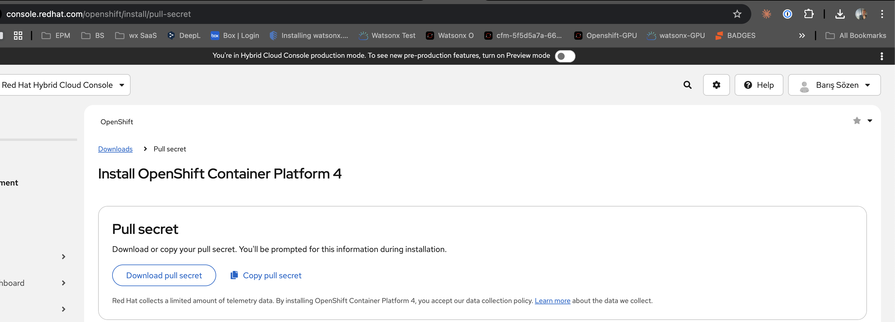
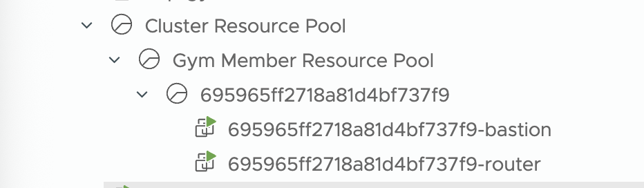

# Technical Workflow: Air-Gapped OpenShift 4.18 Installation

> **Complete step-by-step guide for deploying OpenShift 4.18 in a disconnected environment**

---

## Table of Contents

1. [Prerequisites and Environment Setup](#1-prerequisites-and-environment-setup)
2. [Phase 1: Prepare Bastion Host](#2-phase-1-prepare-bastion-host)
3. [Phase 2: Install Mirror Registry](#3-phase-2-install-mirror-registry)
4. [Phase 3: Configure HTTP Server](#4-phase-3-configure-http-server)
5. [Phase 4: Download OpenShift Tools](#5-phase-4-download-openshift-tools)
6. [Phase 5: Mirror OpenShift Content](#6-phase-5-mirror-openshift-content)
7. [Phase 6: Push Content to Mirror Registry](#7-phase-6-push-content-to-mirror-registry)
8. [Phase 7: Prepare vSphere Environment](#8-phase-7-prepare-vsphere-environment)
9. [Phase 8: Install OpenShift Cluster](#9-phase-8-install-openshift-cluster)
10. [Phase 9: Post-Installation Configuration](#10-phase-9-post-installation-configuration)
11. [Troubleshooting](#11-troubleshooting)

---

## 1. Prerequisites and Environment Setup

### 1.1 VMware vSphere Environment

The deployment uses a VMware vSphere environment with the following resource pool structure:


*Figure 1: vSphere resource pool hierarchy showing the Gym Member Resource Pool containing the bastion and router VMs*

The hierarchy consists of:
- **Cluster Resource Pool** (top-level)
  - **Gym Member Resource Pool**
    - Unique identifier folder (e.g., `695965ff2718a81d4bf737f9`)
      - `*-bastion` - Bastion host VM
      - `*-router` - Network router VM

### 1.2 Required Red Hat Credentials

Before starting, obtain your pull secret from the Red Hat Hybrid Cloud Console:



*Figure 2: Red Hat Hybrid Cloud Console - Download your pull secret from console.redhat.com/openshift/install/pull-secret*

**Steps to obtain pull secret:**
1. Navigate to [console.redhat.com/openshift/install/pull-secret](https://console.redhat.com/openshift/install/pull-secret)
2. Log in with your Red Hat account
3. Click "Download pull secret" or "Copy pull secret"
4. Save to `${XDG_RUNTIME_DIR}/containers/auth.json` on the bastion host

### 1.3 Network Requirements

| Endpoint | Port | Purpose |
|----------|------|---------|
| Bastion SSH | 22 | Administration |
| Quay Registry | 8443 | Container image registry (HTTPS) |
| HTTP Server | 80 | RHCOS OVA hosting |
| vCenter API | 443 | vSphere management |

---

## 2. Phase 1: Prepare Bastion Host

### 2.1 Connect to Bastion Host

```bash
ssh admin@bastion.gym.lan
```

### 2.2 Assess Current Storage

The bastion host starts with limited storage. Check the current disk layout:

```bash
lsblk
```



*Figure 3: Initial disk layout showing sda (50GB OS disk) and sdb (1.5TB new disk)*

**Output interpretation:**
- `sda` (50GB) - Operating system disk with boot partitions and LVM
- `sda1` - EFI boot partition (600MB)
- `sda2` - Boot partition (1GB)
- `sda3` - LVM partition (48.4GB) containing root and swap
- `sdb` (1.5TB) - **New disk** added for mirror registry storage

### 2.3 Add New Disk in vSphere

**In the vSphere Console:**
1. Right-click the bastion VM → **Edit Settings**
2. Click **Add New Device** → **Hard Disk**
3. Set size to 100GB or larger (1.5TB recommended for full mirror)
4. Click **OK** to apply changes

### 2.4 Expand Storage with LVM


*Figure 4: Complete LVM expansion process - extending the root filesystem from 43.4GB to 1.51TB*

**Step-by-step storage expansion:**

```bash
# Check current volume group status
sudo vgs
```
Output: `rhel_bastion 1 2 0 wz--n- 48.41g 0`

```bash
# Extend volume group to include new disk
sudo vgextend rhel_bastion /dev/sdb
```
Output: `Physical volume "/dev/sdb" successfully created. Volume group "rhel_bastion" successfully extended`

```bash
# Extend logical volume to use all free space
sudo lvextend -l +100%FREE /dev/rhel_bastion/root
```
Output: `Size of logical volume rhel_bastion/root changed from 43.41 GiB (11113 extents) to <1.51 TiB (395112 extents)`

```bash
# Grow the XFS filesystem online
sudo xfs_growfs /
```

```bash
# Verify expansion
df -h
```
Output shows `/dev/mapper/rhel_bastion-root` now at **1.6T** with **1.5T available**

---

## 3. Phase 2: Install Mirror Registry

### 3.1 Generate TLS Certificate

The mirror registry requires a valid TLS certificate. Create a self-signed certificate with proper Subject Alternative Names:

```bash
openssl req -newkey rsa:4096 -nodes -sha256 \
    -keyout /home/admin/quay.key \
    -x509 -out /home/admin/quay.crt -days 3650 \
    -subj "/O=gym,CN=registry.gym.lan" \
    -addext "subjectAltName = DNS:registry.gym.lan,IP:192.168.252.2"
```

**Certificate parameters explained:**
- `-newkey rsa:4096` - Generate new 4096-bit RSA key
- `-nodes` - Don't encrypt the private key
- `-sha256` - Use SHA-256 for signing
- `-days 3650` - Certificate valid for 10 years
- `subjectAltName` - Include both DNS name AND IP address (critical for oc-mirror)

### 3.2 Download Mirror Registry Installer

```bash
# Create temporary directory
MIRROR_DIR=$(mktemp -d)

# Download mirror-registry installer
curl -Lo ${MIRROR_DIR}/mirror-registry.tar.gz \
    https://mirror.openshift.com/pub/cgw/mirror-registry/latest/mirror-registry-amd64.tar.gz

# Extract installer
cd ${MIRROR_DIR}
tar xf mirror-registry.tar.gz
```

### 3.3 Install Mirror Registry


*Figure 5: Mirror Registry (Quay) installation process showing execution environment loading and component deployment*

```bash
./mirror-registry install \
    --quayHostname 192.168.252.2 \
    --initUser admin \
    --initPassword QuayForAll! \
    --sslKey /home/admin/quay.key \
    --sslCert /home/admin/quay.crt
```

**Installation process:**
1. Loads execution environment from tar archive
2. Validates SSL certificate and key
3. Sets up SSH keys for Ansible
4. Deploys Quay components via Podman
5. Creates initial admin user

### 3.4 Verify Successful Installation


*Figure 6: Successful Quay installation - Play recap showing ok=42, changed=24, failed=0*

**Verification output indicates:**
- Quay installed at `https://192.168.252.2:8443`
- Config data stored in `~/quay-install`
- Credentials: `admin / QuayForAll!`

### 3.5 Configure Firewall

```bash
# Allow Quay port
sudo firewall-cmd --add-port 8443/tcp --permanent
sudo firewall-cmd --reload
```

### 3.6 Verify Registry Health

```bash
curl -sk https://192.168.252.2:8443/health/instance | jq
```

**Expected output:**
```json
{
  "data": {
    "services": {
      "auth": true,
      "database": true,
      "disk_space": true,
      "registry_gunicorn": true,
      "service_key": true,
      "web_gunicorn": true
    }
  },
  "status_code": 200
}
```

---

## 4. Phase 3: Configure HTTP Server

The HTTP server hosts the RHCOS OVA template for vSphere IPI installation.

### 4.1 Install and Enable Apache

```bash
# Install Apache
sudo dnf install -y httpd

# Enable and start service
sudo systemctl enable httpd --now

# Configure firewall
sudo firewall-cmd --permanent --add-service http
sudo firewall-cmd --reload
```

### 4.2 Download RHCOS OVA


*Figure 7: Downloading RHCOS 4.18 VMware OVA (1346MB) and setting up Apache web server*

```bash
# Set version
RHCOS_VERSION=4.18

# Download RHCOS OVA for VMware
curl -Lo rhcos-vmware.x86_64.ova \
    https://mirror.openshift.com/pub/openshift-v4/amd64/dependencies/rhcos/${RHCOS_VERSION}/latest/rhcos-vmware.x86_64.ova

# Move to web server directory
sudo mv rhcos-vmware.x86_64.ova /var/www/html

# Fix SELinux context
sudo restorecon -Rv /var/www/html
```

### 4.3 Verify OVA Accessibility

```bash
# Get SHA256 checksum for install-config.yaml
sha256sum /var/www/html/rhcos-vmware.x86_64.ova

# Test HTTP access
curl -I http://192.168.252.2/rhcos-vmware.x86_64.ova
```

---

## 5. Phase 4: Download OpenShift Tools

### 5.1 Install OpenShift Client (oc)

```bash
OCP_VERSION=stable-4.18

# Download oc client
curl -Lo openshift-client-linux.tar.gz \
    https://mirror.openshift.com/pub/openshift-v4/clients/ocp/${OCP_VERSION}/openshift-client-linux-amd64-rhel8.tar.gz

# Extract and install
tar xf openshift-client-linux.tar.gz oc
sudo install oc /usr/local/bin

# Verify
oc version
```

### 5.2 Install oc-mirror Plugin

```bash
OCP_VERSION=stable-4.18

# Download oc-mirror
curl -Lo oc-mirror.tar.gz \
    https://mirror.openshift.com/pub/openshift-v4/x86_64/clients/ocp/${OCP_VERSION}/oc-mirror.tar.gz

# Extract and install
tar xf oc-mirror.tar.gz oc-mirror
chmod +x oc-mirror
sudo install oc-mirror /usr/local/bin

# Verify
oc-mirror v2 version
```

### 5.3 Install OpenShift Installer

```bash
OCP_VERSION=stable-4.18

# Download installer
curl -Lo openshift-install-linux.tar.gz \
    https://mirror.openshift.com/pub/openshift-v4/clients/ocp/${OCP_VERSION}/openshift-install-linux.tar.gz

# Extract and install
tar xf openshift-install-linux.tar.gz openshift-install
sudo install openshift-install /usr/local/bin

# Verify
openshift-install version
```

---

## 6. Phase 5: Mirror OpenShift Content

### 6.1 Configure Registry Authentication

Add your mirror registry credentials to the pull secret:

```bash
# Generate base64 credentials
REG_CREDS=$(echo -n 'admin:QuayForAll!' | base64)

# View credential JSON (add to pull secret)
cat <<EOF
{"auths":{"192.168.252.2:8443":{"auth":"${REG_CREDS}","email":"admin@quay.io"}}}
EOF
```

Edit the pull secret file:
```bash
vi ${XDG_RUNTIME_DIR}/containers/auth.json
```

### 6.2 Explore Available Content

```bash
# List available OpenShift releases
oc-mirror list releases --channel stable-4.18

# List available operators in Red Hat catalog
oc-mirror list operators \
  --catalog registry.redhat.io/redhat/redhat-operator-index:v4.18 2>/dev/null \
  | grep -E "odf-operator|ocs-operator|openshift-cert-manager-operator|local-storage-operator|nfd|rhods-operator"

# List GPU operator in Certified catalog
oc-mirror list operators \
  --catalog registry.redhat.io/redhat/certified-operator-index:v4.18 2>/dev/null \
  | grep "gpu-operator-certified"
```

### 6.3 Create ImageSetConfiguration

Create the mirroring configuration file:

```bash
cat <<EOF > ${HOME}/isc-platform-4.18.yaml
kind: ImageSetConfiguration
apiVersion: mirror.openshift.io/v1alpha2
storageConfig:
  local:
    path: ./
mirror:
  platform:
    channels:
    - name: stable-4.18
      type: ocp
      # Note: Removed minVersion to avoid graph errors
    graph: true
  operators:
  # -------------------------------------------------------------------------
  # CATALOG 1: RED HAT OPERATORS (v4.18)
  # -------------------------------------------------------------------------
  - catalog: registry.redhat.io/redhat/redhat-operator-index:v4.18
    packages:
    # --- OpenShift Data Foundation (ODF) ---
    - name: odf-operator
      channels:
      - name: stable-4.18
    - name: ocs-operator
      channels:
      - name: stable-4.18
    - name: odf-csi-addons-operator
      channels:
      - name: stable-4.18
    - name: mcg-operator
      channels:
      - name: stable-4.18
    # --- Red Hat Cert Manager ---
    - name: openshift-cert-manager-operator
      channels:
      - name: stable-v1
    # --- Local Storage Operator ---
    - name: local-storage-operator
      channels:
      - name: stable
    # --- Node Feature Discovery (NFD) ---
    - name: nfd
      channels:
      - name: stable
    # --- OpenShift AI (formerly RHODS) ---
    - name: rhods-operator
      channels:
      - name: stable
  # -------------------------------------------------------------------------
  # CATALOG 2: CERTIFIED OPERATORS (v4.18)
  # -------------------------------------------------------------------------
  - catalog: registry.redhat.io/redhat/certified-operator-index:v4.18
    packages:
    # --- NVIDIA GPU ---
    - name: gpu-operator-certified
      channels:
      - name: v25.10
EOF
```

### 6.4 Execute Mirroring

```bash
# Mirror to local disk (creates tar archives)
oc-mirror --config=${HOME}/isc-platform-4.18.yaml file://ocp-4.18 --v1
```

**Note:** This process can take 1-3 hours depending on network speed. Monitor progress:

```bash
# Monitor disk usage
watch du -sh ocp-4.18

# Monitor oc-mirror process
top -p $(pgrep -d',' oc-mirror)

# View logs
tail -f .oc-mirror.log
```

---

## 7. Phase 6: Push Content to Mirror Registry

### 7.1 Login to Mirror Registry

```bash
podman login 192.168.252.2:8443 --tls-verify=false
```

### 7.2 Push Mirrored Content

```bash
# Push first sequence (platform images)
oc-mirror --from=ocp-4.18/mirror_seq1_000000.tar \
    docker://192.168.252.2:8443 --v1 --dest-skip-tls

# If additional sequences exist, push them too
# oc-mirror --from=ocp-4.18/mirror_seq2_000000.tar docker://192.168.252.2:8443 --v1 --dest-skip-tls
```

---

## 8. Phase 7: Prepare vSphere Environment

### 8.1 Import vCenter CA Certificate

```bash
VCENTER_HOSTNAME=ocpgym-vc.techzone.ibm.local

# Download vCenter certificates
curl -kL https://${VCENTER_HOSTNAME}/certs/download.zip -o download.zip

# Extract and trust certificates
unzip download.zip
sudo cp certs/lin/* /etc/pki/ca-trust/source/anchors
sudo update-ca-trust extract

# Cleanup
rm -rf download.zip certs/
```

### 8.2 Verify vCenter Connectivity

```bash
curl -s https://${VCENTER_HOSTNAME}/sdk | head -5
```

---

## 9. Phase 8: Install OpenShift Cluster

### 9.1 Generate Install Configuration

```bash
openshift-install create install-config
```

**Interactive prompts:**
- **SSH Public Key**: Select your SSH key
- **Platform**: vsphere
- **vCenter**: ocpgym-vc.techzone.ibm.local
- **Username**: Your vSphere username
- **Password**: Your vSphere password
- **Datacenter**: Select from list
- **Cluster**: Select from list
- **Network**: Select from list
- **VIP for API**: 192.168.252.3
- **VIP for Ingress**: (next available IP)
- **Base Domain**: gym.lan
- **Cluster Name**: ocpinstall
- **Pull Secret**: Paste your combined pull secret

### 9.2 Customize Install Configuration

Edit the generated `install-config.yaml` to add:

```yaml
# Add mirror registry CA certificate
additionalTrustBundle: |
  -----BEGIN CERTIFICATE-----
  <contents of /home/admin/quay.crt>
  -----END CERTIFICATE-----

# Add image content source policies
imageContentSources:
- mirrors:
  - 192.168.252.2:8443/openshift/release-images
  source: quay.io/openshift-release-dev/ocp-release
- mirrors:
  - 192.168.252.2:8443/openshift/release
  source: quay.io/openshift-release-dev/ocp-v4.0-art-dev

# Add platform-specific configuration for RHCOS OVA
platform:
  vsphere:
    clusterOSImage: http://192.168.252.2/rhcos-vmware.x86_64.ova
```

### 9.3 Create Installation Directory

```bash
mkdir ocpinstall
cp install-config.yaml ocpinstall/
```

### 9.4 Execute Installation

```bash
openshift-install create cluster --dir ocpinstall --log-level debug
```

**Expected timeline:**
- Bootstrap VM creation: ~5 minutes
- Bootstrap complete: ~15-20 minutes
- Control plane ready: ~10 minutes
- Workers ready: ~10 minutes
- **Total: ~40-50 minutes**

---

## 10. Phase 9: Post-Installation Configuration

### 10.1 Set Kubeconfig

```bash
export KUBECONFIG=${HOME}/ocpinstall/auth/kubeconfig
```

### 10.2 Disable Default OperatorHub Sources

```bash
oc patch OperatorHub cluster --type json \
    -p '[{"op": "add", "path": "/spec/disableAllDefaultSources","value": true}]'
```

### 10.3 Apply Mirror Configuration

```bash
# Apply ImageContentSourcePolicy
oc apply -f ${HOME}/oc-mirror-workspace/results-*/imageContentSourcePolicy.yaml

# Apply CatalogSources
oc apply -f ${HOME}/oc-mirror-workspace/results-*/catalogSource-cs-redhat-operator-index.yaml
oc apply -f ${HOME}/oc-mirror-workspace/results-*/catalogSource-cs-certified-operator-index.yaml

# Apply release signatures
oc apply -f ${HOME}/oc-mirror-workspace/results-*/release-signatures/
```

### 10.4 Verify OperatorHub


*Figure 8: OpenShift OperatorHub showing 5 available operators from the mirrored catalog - cert-manager, Local Storage, NFD, ODF, and OpenShift AI*

```bash
# Check catalog source pods
oc -n openshift-marketplace get pods

# Verify operators are available
oc get packagemanifests -n openshift-marketplace
```

**Expected operators visible in OperatorHub:**
- cert-manager Operator for Red Hat OpenShift
- Local Storage
- Node Feature Discovery Operator
- OpenShift Data Foundation
- Red Hat OpenShift AI

### 10.5 Verify Cluster Health

```bash
# Check all nodes
oc get nodes

# Check cluster operators
oc get clusteroperators

# Check machine config pools
oc get mcp
```

---

## 11. Troubleshooting

### 11.1 Mirror Registry Issues

**Problem:** Cannot pull images from mirror registry
```bash
# Verify registry health
curl -sk https://192.168.252.2:8443/health/instance | jq

# Check podman trust
podman login 192.168.252.2:8443 --tls-verify=false
```

### 11.2 oc-mirror Graph Errors

**Problem:** `minVersion` causes graph calculation errors

**Solution:** Remove `minVersion` from ImageSetConfiguration:
```yaml
# Before (causes errors)
channels:
- name: stable-4.18
  type: ocp
  minVersion: 4.18.0

# After (works)
channels:
- name: stable-4.18
  type: ocp
```

### 11.3 Catalog Source Not Ready

**Problem:** CatalogSource pods not starting

```bash
# Check pod status
oc -n openshift-marketplace get pods

# Delete and recreate pods
oc delete pod -l olm.catalogSource=cs-redhat-operator-index -n openshift-marketplace

# Check pod logs
oc logs -l olm.catalogSource=cs-redhat-operator-index -n openshift-marketplace
```

### 11.4 Missing Operator Dependencies

**Problem:** ODF operator stuck in pending due to missing dependencies

**Solution:** Ensure all dependent operators are mirrored:
- `odf-operator`
- `ocs-operator`
- `odf-csi-addons-operator`
- `mcg-operator`

Re-mirror with updated ImageSetConfiguration and apply new catalogs.

---

## Next Steps

After successful installation:

1. **Configure OAuth** - Set up identity provider
2. **Install ODF** - Deploy software-defined storage
3. **Install OpenShift AI** - Enable AI/ML workloads
4. **Configure GPU nodes** - If using NVIDIA GPUs

---

*Document Version: 1.0 | Last Updated: January 2026*
